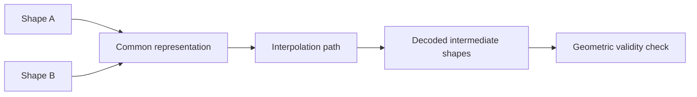

Interpolation sounds simple: take shape A, take shape B, and slide between them.

In practice, almost everything depends on the space in which the interpolation happens. If that space does not respect correspondence, topology, or semantic structure, the path between the endpoints may be smooth numerically while looking implausible geometrically.

## The Core Question

When we say "interpolate between two shapes", we are really asking for a trajectory

\[
S(t), \quad t \in [0,1]
\]

such that \(S(0) = S_A\) and \(S(1) = S_B\), while intermediate states remain meaningful.

The word meaningful hides most of the difficulty.

<div class="concept-grid">
  <div class="concept-card">
    <h3>Vertex space</h3>
    <p>Fast and direct, but only valid when vertices already represent the same semantic locations.</p>
  </div>
  <div class="concept-card">
    <h3>Spectral space</h3>
    <p>More geometry-aware, often smoother, but basis alignment and truncation become central issues.</p>
  </div>
  <div class="concept-card">
    <h3>Learned latent space</h3>
    <p>Can model nonlinear structure, but interpolation quality depends on what the representation has actually learned.</p>
  </div>
</div>

## Why Linear Blending Works Sometimes

Suppose two meshes share the same connectivity and aligned vertices:

\[
V(t) = (1-t)V_A + tV_B.
\]

This works surprisingly well when the deformation is small and the correspondence is reliable.

It fails for at least three reasons:

1. Corresponding vertices may not represent the same semantic point.
2. Euclidean averages do not preserve rigid motion well.
3. Large deformations can create shrinking, ghosting, or implausible transitions.



The important point is that the representation sits in the middle of the pipeline. If the common representation is poor, interpolation will be poor no matter how elegant the blending rule looks.

## Interpolation Is Mostly About Correspondence

A clean mental model is:

- correspondence tells you what should be blended
- representation tells you how blending is performed
- regularization tells you which intermediate shapes are acceptable

Without correspondence, interpolation is often just averaging unrelated coordinates.

<div class="technical-callout">
  <h3>Technical note</h3>
  <p>For articulated objects, correspondence quality often matters more than model complexity. A simple interpolant with strong alignment can outperform a sophisticated latent model trained on weakly aligned data.</p>
</div>

## Spectral Thinking

Another route is to project shapes onto a basis, often Laplace-Beltrami eigenfunctions:

\[
\alpha_i = \langle f, \phi_i \rangle.
\]

Now interpolation happens in coefficient space rather than directly on vertices.

This brings two benefits:

1. Low frequencies encode coarse structure and give smooth transitions.
2. The basis reveals how much of the interpolation is geometry-driven versus noise-driven.

But it also introduces new fragilities:

- truncated bases may oversmooth local details
- sign or ordering inconsistencies in eigenfunctions can break alignment
- different shapes may not share a stable basis without additional synchronization

## A Practical Recipe

When I want interpolation that is visually convincing and analytically understandable, I usually ask the following questions in order:

1. Do I trust the correspondence?
2. Is the deformation mostly rigid, mostly elastic, or highly topological?
3. Do I care more about local detail or about a smooth global path?
4. Do I need interpretable controls, or just plausible synthesis?

Those questions usually determine the representation before they determine the model.

## Minimal Implementation Sketch

```python
def interpolate_shapes(shape_a, shape_b, t, representation):
    rep_a = representation.encode(shape_a)
    rep_b = representation.encode(shape_b)

    rep_t = (1.0 - t) * rep_a + t * rep_b
    shape_t = representation.decode(rep_t)

    return shape_t
```

This code is deliberately boring. The real work is hidden in `encode` and `decode`.

## What I Watch For In Practice

<div class="comparison-grid">
  <div class="comparison-card">
    <h3>Good sign</h3>
    <p>Intermediate shapes preserve semantic parts and move along an interpretable path.</p>
  </div>
  <div class="comparison-card">
    <h3>Warning sign</h3>
    <p>Intermediate states collapse volume, drift semantically, or introduce local artifacts that were absent at both endpoints.</p>
  </div>
</div>

Interpolation is therefore not just a convenience tool. It is a diagnostic lens. It tells us whether the representation has learned a usable geometry of shape variation or only memorized endpoints.
