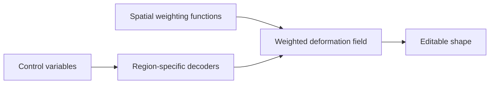

When a learned deformation model uses a single global latent code, it often becomes very good at producing plausible deformations and very bad at accepting precise edits.

That trade-off is easy to miss when evaluating only reconstruction or generation quality.

## The Problem With Global Control

Assume a decoder predicts a deformation field

\[
\Delta x = f\_\theta(x, z),
\]

where \(z\) is a global latent variable.

This is expressive, but global latents often entangle several factors:

- pose and identity
- coarse and fine detail
- local edits and global compensation

As a result, changing one dimension of \(z\) may alter multiple regions at once.

<div class="concept-grid">
  <div class="concept-card">
    <h3>Global control</h3>
    <p>Simple to parameterize, but edits propagate in ways that are hard to predict.</p>
  </div>
  <div class="concept-card">
    <h3>Localized control</h3>
    <p>Associates control signals with spatial support, making edits more interpretable and easier to constrain.</p>
  </div>
  <div class="concept-card">
    <h3>Desired behavior</h3>
    <p>Changing one region should not force unrelated regions to drift unless the deformation model has a clear reason.</p>
  </div>
</div>

## A Useful Design Principle

Instead of asking for a single latent code that explains everything, we can ask for a set of control variables \(\{z_r\}\) attached to regions \(r\):

\[
\Delta x = \sum*r w_r(x) f*{\theta_r}(x, z_r),
\]

where \(w_r(x)\) acts like a soft spatial mask.

The key point is not the exact formula. The point is that spatial support becomes explicit.



## Why This Improves Editability

Localized control changes the interaction model in three ways.

1. It becomes easier to understand which parameter controls which region.
2. It becomes easier to regularize edits so they remain spatially coherent.
3. It becomes easier to debug failure cases because deformation leakage is visible.

<div class="technical-callout">
  <h3>Debugging heuristic</h3>
  <p>If an edit applied near the mouth starts changing the forehead or neck, the issue is often not capacity. It is a locality failure in the representation or the control parameterization.</p>
</div>

## What Locality Does Not Mean

Locality does not mean every region is independent.

Many deformations are correlated, especially for articulation and soft tissue motion. A useful model should allow coupling while still preserving control semantics.

This is why soft masks are usually preferable to hard partitions. They let the model express interaction without collapsing back into a single entangled latent.

## Implementation Intuition

One practical recipe is:

1. predict or learn region supports
2. attach latent variables to those supports
3. combine local predictions with smooth weighting functions
4. regularize overlap, sparsity, or smoothness depending on the application

```python
def deform(points, local_codes, masks, local_decoders):
    total = 0.0
    for code, mask, decoder in zip(local_codes, masks, local_decoders):
        total = total + mask(points) * decoder(points, code)
    return total
```

The formula is simple. The subtlety lies in making the masks stable, expressive, and compatible with the target data.

## Why This Matters For Research

For interactive or controllable systems, localized control is not just a convenience feature.

It affects:

- how interpretable the learned space becomes
- how usable the model is for downstream editing
- how robustly we can inspect what the model has actually learned

In other words, locality is both a modeling choice and an interface choice.

That is one reason I find localized control particularly compelling for deformation modeling: it pushes us toward representations that are not only powerful, but also understandable.
